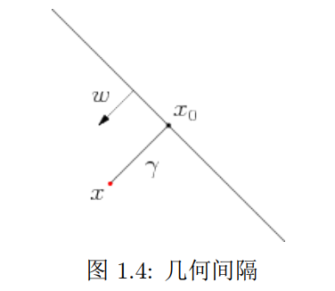

参考 
**支持向量机通俗导论（理解SVM的三层境界）**：[http://blog.csdn.net/v_july_v/article/details/7624837](http://blog.csdn.net/v_july_v/article/details/7624837)

## 1. 最大间隔分类器

### 1.1 logistic regression

**0/1分类：** 给sigmoid之前的函数值`\(\theta^Tx\)`是负无穷到正无穷，sigmoid之后的值相当于取y=1时的概率值，大于0.5就视为1的类。如果`\(\theta^Tx>0\)`则`\(sigmoid(\theta^Tx)>0.5\)`，换言之，要学到参数`\(\theta\)`，使正例的的`\(\theta^Tx\)`远大于0，负例的`\(\theta^Tx\)`远小于0.

### 1.2 +1/-1分类

svm中，使用+1/-1分类，而非logistic regression的0/1分类。

`\[
g(f(x))=g(\omega^Tx+b) =
\begin{cases}
+1, \omega^Tx+b >= 0 \\
-1, \omega^Tx+b < 0 \\
\end{cases}
\]`

所以，要寻找超平面的两条边界间的最大间隔，从而求w和b。

### 1.3 函数间隔与几何间隔

#### 1.3.1 函数间隔(functional margin)`\(\hat{\gamma}\)`

函数间隔：`\(\hat{\gamma}=y(\omega^Tx+b)=yf(x)\)`

超平面`\((\omega,b)\)`关于数据集T上的函数间隔：(w,b)关于T中所以样本点的函数间隔的最小值：`\(\hat{\gamma}=min\hat{\gamma}_i,i=0,1,...\)`

当w，b同时扩大时，超平面没变（`\(\omega^Tx+b=0,2\omega^Tx+2b=0\)`），**但函数间隔却变大了**，所以，需要规范化。

#### 1.3.2 几何间隔(geometric margin)`\(\tilde{\gamma}\)`

点`\(x\)`投影到超平面的点为`\(x_0\)`,因为w是垂直于超平面的法向量，设`\(x\)`到超平面的距离是`\(\gamma\)`,那么

`\[
x=x_0+\gamma \frac{\omega}{||\omega||}
\]`

