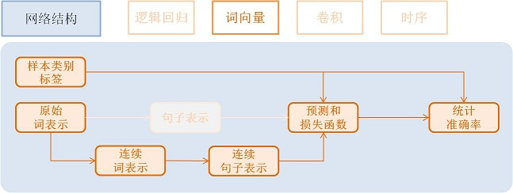
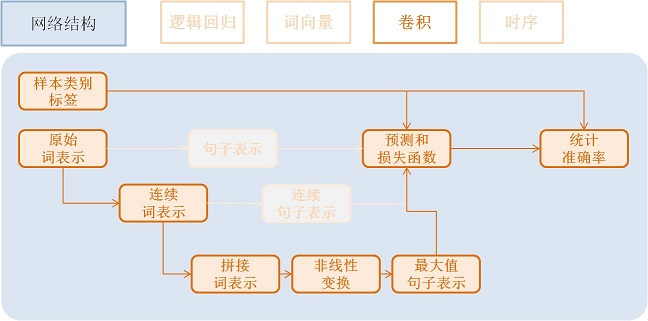
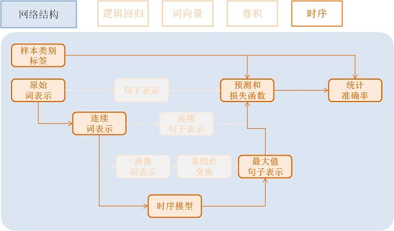

# PaddlePaddle快速入门教程

我们以文本分类问题作为背景，介绍PaddlePaddle使用流程和常用的网络基础单元的配置方法。

## 使用概述(Overview)

**文本分类问题**：对于给定的一条文本， 我们从提前给定的类别集合中选择其所属类
别。比如通过用户对电子商务网站评论，评估产品的质量：

- 这个显示器很棒！ （好评）
- 用了两个月之后这个显示器屏幕碎了。（差评）

每一个任务流程都可以分为如下5个基础部分。


1. 数据格式准备
    - 每行保存一条样本，类别Id 和文本信息用Tab间隔， 文本中的单词用空格分隔（如果不切词，则字与字之间用空格分隔），例如：```类别Id ‘\t’ 这 个 显 示 器 很 棒 ！```
2. 数据向模型传送
    - PaddlePaddle可以读取Python写的传输数据脚本，所有字符都将转换为连续整数表示的Id传给模型
3. 网络结构（由易到难展示4种不同的网络配置）
    - 逻辑回归模型
    - 词向量模型
    - 卷积模型
    - 时序模型
    - 优化算法
4. 训练模型
5. 预测

## 数据格式准备(Data Preparation)
在本问题中，我们使用[Amazon电子产品评论数据](http://jmcauley.ucsd.edu/data/amazon/)，
将评论分为好评(正样本)和差评(负样本)两类。[源码](https://github.com/baidu/Paddle)的`demo/quick_start`里提供了数据下载脚本
和预处理脚本。

```bash
cd demo/quick_start
./data/get_data.sh
./preprocess.sh
```

## 数据向模型传送(Transfer Data to Model)

### Python数据加载脚本(Data Provider Script)

下面dataprovider_bow.py文件给出了完整例子，主要包括两部分：

* initalizer： 定义文本信息、类别Id的数据类型。settings变量必传，必须初始化**settings.input_types**变量；还可以通过kwargs传入参数，给settings定义其他变量，例如这里的settings.word_dict，例如seq2seq里的job_mode、src_dict、slots（类似input_types，semantic_role_labeling里面也用的slots）。
* process： 需要@provider，init_hook=上面定义的hook函数（initializer）。process有两个参数，一个是settings，另一个是file_name（传给define_py_data_sources2的train_list或者test_list）。yield文本信息和类别Id，和initalizer里定义顺序一致。


from paddle.trainer.PyDataProvider2 import *

# id of the word not in dictionary
UNK_IDX = 0

# initializer is called by the framework during initialization.
# It allows the user to describe the data types and setup the
# necessary data structure for later use.
# `settings` is an object. initializer need to properly fill settings.input_types.
# initializer can also store other data structures needed to be used at process().
# In this example, dictionary is stored in settings.
# `dictionay` and `kwargs` are arguments passed from trainer_config.lr.py
def initializer(settings, dictionary, **kwargs):
    # Put the word dictionary into settings
    settings.word_dict = dictionary

    # setting.input_types specifies what the data types the data provider
    # generates.
    settings.input_types = [
        # The first input is a sparse_binary_vector,
        # which means each dimension of the vector is either 0 or 1. It is the
        # bag-of-words (BOW) representation of the texts.
        sparse_binary_vector(len(dictionary)),
        # The second input is an integer. It represents the category id of the
        # sample. 2 means there are two labels in the dataset.
        # (1 for positive and 0 for negative)
        integer_value(2)]

# Delaring a data provider. It has an initializer 'data_initialzer'.
# It will cache the generated data of the first pass in memory, so that
# during later pass, no on-the-fly data generation will be needed.
# `setting` is the same object used by initializer()
# `file_name` is the name of a file listed train_list or test_list file given
# to define_py_data_sources2(). See trainer_config.lr.py.
@provider(init_hook=initializer, cache=CacheType.CACHE_PASS_IN_MEM)
def process(settings, file_name):
    # Open the input data file.
    with open(file_name, 'r') as f:
        # Read each line.
        for line in f:
            # Each line contains the label and text of the comment, separated by \t.
            label, comment = line.strip().split('\t')

            # Split the words into a list.
            words = comment.split()

            # convert the words into a list of ids by looking them up in word_dict.
            word_vector = [settings.word_dict.get(w, UNK_IDX) for w in words]

            # Return the features for the current comment. The first is a list
            # of ids representing a 0-1 binary sparse vector of the text,
            # the second is the integer id of the label.
            yield word_vector, int(label)



### 配置中的数据加载定义(Data Provider in Configure)

在模型配置中利用`define_py_data_sources2`加载数据：


from paddle.trainer_config_helpers import *

file = "data/dict.txt"
word_dict = dict()
with open(dict_file, 'r') as f:
    for i, line in enumerate(f):
        w = line.strip().split()[0]
        word_dict[w] = i
# define the data sources for the model.
# We need to use different process for training and prediction.
# For training, the input data includes both word IDs and labels.
# For prediction, the input data only includs word Ids.
define_py_data_sources2(train_list='data/train.list',
                        test_list='data/test.list',
                        module="dataprovider_bow",
                        obj="process",
                        args={"dictionary": word_dict})


* data/train.list,data/test.list: 指定训练、测试数据
* module="dataprovider": 数据处理Python文件名
* obj="process": 指定生成数据的函数
* args={"dictionary": word_dict}: 额外的参数，这里指定词典

更详细用例请参考文档<a href = "http://www.paddlepaddle.org/doc/ui/data_provider/python_case.html">Python Use Case</a>，
数据格式和详细文档请参考<a href = "http://www.paddlepaddle.org/doc/ui/data_provider/pydataprovider2.html">
PyDataProviderWrapper</a>。

## 网络结构(Network Architecture)
本节我们将专注于网络结构的介绍。


我们将以基本的逻辑回归网络作为起点，并逐渐展示更加深入的功能。更详细的网络配置
连接请参考<a href = "http://www.paddlepaddle.org/doc/layer.html">Layer文档</a>。
所有配置在[源码](https://github.com/baidu/Paddle)`demo/quick_start`目录，首先列举逻辑回归网络。

### 逻辑回归模型(Logistic Regression)

流程如下：


- 获取利用one-hot vector表示的每个单词，维度是词典大小

```python
word = data_layer(name="word",  size=word_dim)
```

- 获取该条样本类别Id，维度是类别个数。

```python
label = data_layer(name="label", size=label_dim)
```

- 利用逻辑回归模型对该向量进行分类，同时会计算分类准确率


# Define a fully connected layer with logistic activation (also called softmax activation).
output = fc_layer(input=word,
                  size=label_dim,
                  act_type=SoftmaxActivation())
# Define cross-entropy classification loss and error.
classification_cost(input=output, label=label)


 - input: 除过data层，每个层都有一个或多个input,多个input以list方式输入
 - size: 该层神经元个数
 - act_type: 激活函数类型

效果总结：我们将在后面介绍训练和预测的流程的脚本。在此为方便对比不同网络结构，
我们随时总结了各个网络的复杂度和效果。

<html>
<center>
<table border="2" cellspacing="0" cellpadding="6" rules="all" frame="border">

<thead>
<tr>
<th scope="col" class="left">网络名称</th>
<th scope="col" class="left">参数数量</th>
<th scope="col" class="left">错误率</th>
</tr>
</thead>

<tbody>
<tr>
<td class="left">逻辑回归</td>
<td class="left">252 KB</td>
<td class="left">8.652%</td>
</tr>

</tbody>
</table></center>
</html>
<br>

### 词向量模型(Word Vector)

embedding模型需要稍微改变数据提供的脚本，即`dataprovider_emb.py`，词向量模型、
卷积模型、时序模型均使用该脚本。其中文本输入类型定义为整数时序类型integer_value_sequence。



def initializer(settings, dictionary, **kwargs):
    settings.word_dict = dictionary
    settings.input_types = [
        # Define the type of the first input as sequence of integer.
        # The value of the integers range from 0 to len(dictrionary)-1
        integer_value_sequence(len(dictionary)),
        # Define the second input for label id
        integer_value(2)]

@provider(init_hook=initializer)
def process(settings, file_name):
    ...
    # omitted, it is same as the data provider for LR model


该模型依然是使用逻辑回归分类网络的框架， 只是将句子利用连续向量表示替换稀疏
向量表示， 即对第3步进行替换。句子表示的计算更新为2步：


- 利用单词Id查找对应的该单词的连续表示向量(维度为word_dim)， 输入N个单词，输出为N个word_dim维度向量

```python
emb = embedding_layer(input=word, size=word_dim)
```

- 将该句话包含的所有单词向量求平均得到句子的表示

```python
avg = pooling_layer(input=emb, pooling_type=AvgPooling())
```

其它部分和逻辑回归网络结构一致。
效果总结：

<center>
<table border="2" cellspacing="0" cellpadding="6" rules="all" frame="border">

<thead>
<tr>
<th scope="col" class="left">网络名称</th>
<th scope="col" class="left">参数数量</th>
<th scope="col" class="left">错误率</th>
</tr>
</thead>

<tbody>
<tr>
<td class="left">词向量模型</td>
<td class="left">15 MB</td>
<td class="left">8.484%</td>
</tr>

</tbody>
</table>
</center>
<br>

### 卷积模型(Convolution)
卷积网络是一种特殊的从词向量表示到句子表示的方法， 也就是将词向量模型额步
骤3-2进行进一步演化， 变为3个新的子步骤。


文本卷积分为三个步骤：
1. 获取每个单词左右各k个近邻， 拼接成一个新的向量表示；
2. 对该表示进行非线性变换 （例如Sigmoid变换）, 成为维度为hidden_dim的新的向量；
3. 在每个维度上取出在该句话新的向量集合上该维度的最大值作为最后的句子表示向量。 这3个子步骤可配置为:

```python
text_conv = sequence_conv_pool(input=emb,
	                           context_start=k,
	                           context_len=2 * k + 1)
```

效果总结：

<center>
<table border="2" cellspacing="0" cellpadding="6" rules="all" frame="border">

<thead>
<tr>
<th scope="col" class="left">网络名称</th>
<th scope="col" class="left">参数数量</th>
<th scope="col" class="left">错误率</th>
</tr>
</thead>

<tbody>
<tr>
<td class="left">卷积模型</td>
<td class="left">16 MB</td>
<td class="left">5.628%</td>
</tr>

</tbody>
</table></center>
<br>

 
### 时序模型(Time Sequence)


时序模型即为RNN模型, 包括简单的RNN模型、GRU模型、LSTM模型等。

- GRU模型配置：

```python
gru = simple_gru(input=emb, size=gru_size)
```

- LSTM模型配置：

```python
lstm = simple_lstm(input=emb, size=lstm_size)
```

针对本问题，我们采用单层LSTM模型，并使用了Dropout，效果总结：

<center>
<table border="2" cellspacing="0" cellpadding="6" rules="all" frame="border">

<thead>
<tr>
<th scope="col" class="left">网络名称</th>
<th scope="col" class="left">参数数量</th>
<th scope="col" class="left">错误率</th>
</tr>
</thead>

<tbody>
<tr>
<td class="left">时序模型</td>
<td class="left">16 MB</td>
<td class="left">4.812%</td>
</tr>

</tbody>
</table></center>
<br>

## 优化算法(Optimization Algorithm)
<a href = "http://www.paddlepaddle.org/doc/ui/trainer_config_helpers_api.html#module-paddle.trainer_config_helpers.optimizers">优化算法</a>包括
Momentum, RMSProp，AdaDelta，AdaGrad，ADAM，Adamax等，这里采用Adam优化方法，加了L2正则和梯度截断。

```python
settings(batch_size=128,
         learning_rate=2e-3,
         learning_method=AdamOptimizer(),
         regularization=L2Regularization(8e-4),
         gradient_clipping_threshold=25)
```

## 训练模型(Training Model)
在完成了数据和网络结构搭建之后， 我们进入到训练部分。


训练脚本：我们将训练的命令行保存在了 `train.sh`文件中。训练时所需设置的主要参数如下：

```bash
paddle train \
--config=trainer_config.py \
--log_period=20 \
--save_dir=./output \
--num_passes=15 \
--use_gpu=false
```
这里没有介绍多机分布式训练，可以参考<a href = "../../cluster/index.html">分布式训练</a>的demo学习如何进行多机训练。

## 预测(Prediction)
可以使用训练好的模型评估带有label的验证集，也可以预测没有label的测试集。


测试脚本如下，将会测试配置文件中test.list指定的数据。

```bash
paddle train \
--use_gpu=false \
--job=test \
--init_model_path=./output/pass-0000x
```

可以参考<a href = "../../ui/predict/swig_py_paddle.html">Python API预测</a>
教程，或其他<a href = "../../demo/index.html">demo</a>的Python预测过程。也可以通过如下方式预测。

预测脚本(`predict.sh`)：

```bash
model="output/pass-00003"
paddle train \
    --config=trainer_config.lstm.py \
    --use_gpu=false \
    --job=test \
    --init_model_path=$model \
    --config_args=is_predict=1 \
    --predict_output_dir=. \

mv rank-00000 result.txt
```
这里以`output/pass-00003`为例进行预测，用户可以根据训练log选择test结果最好的模型来预测。与训练网络配置不同的是：无需label相关的层，指定outputs输出概率层(softmax输出)，
指定batch_size=1，数据传输无需label数据，预测数据指定test_list的位置。

预测结果以文本的形式保存在`result.txt`中，一行为一个样本，格式如下：

```
预测ID;ID为0的概率 ID为1的概率
预测ID;ID为0的概率 ID为1的概率
```


is_predict = get_config_arg('is_predict', bool, False)
trn = 'data/train.list' if not is_predict else None
tst = 'data/test.list' if not is_predict else 'data/pred.list'
obj = 'process' if not is_predict else 'process_pre'
batch_size = 128 if not is_predict else 1
if is_predict:
    maxid = maxid_layer(output)
    outputs([maxid,output])
else:
    label = data_layer(name="label", size=2)
    cls = classification_cost(input=output, label=label)
    outputs(cls)


## 总体效果总结(Summary)
这些流程中的数据下载、网络配置、训练脚本在`/demo/quick_start`目录，我们在此总
结上述网络结构在Amazon-Elec测试集(25k)上的效果:

<center>
<table border="2" cellspacing="0" cellpadding="6" rules="all" frame="border">

<thead>
<tr>
<th scope="col" class="left">网络名称</th>
<th scope="col" class="left">参数数量</th>
<th scope="col" class="left">错误率</th>
<th scope="col" class="left">配置文件</th>
</tr>
</thead>

<tbody>
<tr>
<td class="left">逻辑回归模型</td>
<td class="left"> 252KB </td>
<td class="left">8.652%</td>
<td class="left">trainer_config.lr.py</td>
</tr>

<tr>
<td class="left">词向量模型</td>
<td class="left"> 15MB </td>
<td class="left"> 8.484%</td>
<td class="left">trainer_config.emb.py</td>
</tr>

<tr>
<td class="left">卷积模型</td>
<td class="left"> 16MB </td>
<td class="left"> 5.628%</td>
<td class="left">trainer_config.cnn.py</td>
</tr>

<tr>
<td class="left">时序模型</td>
<td class="left"> 16MB </td>
<td class="left"> 4.812%</td>
<td class="left">trainer_config.lstm.py</td>
</tr>

</tbody>
</table>
</center>
<br>

## 附录(Appendix)

### 命令行参数(Command Line Argument)

* \--config：网络配置
* \--save_dir：模型存储路径
* \--log_period：每隔多少batch打印一次日志
* \--num_passes：训练轮次，一个pass表示过一遍所有训练样本
* \--config_args：命令指定的参数会传入网络配置中。
* \--init_model_path：指定初始化模型路径，可用在测试或训练时指定初始化模型。

默认一个pass保存一次模型，也可以通过saving_period_by_batches设置每隔多少batch保存一次模型。
可以通过show_parameter_stats_period设置打印参数信息等。
其他参数请参考<a href = "../../ui/index.html#command-line-argument">令行参数文档</a>。

### 输出日志(Log)

```
TrainerInternal.cpp:160]  Batch=20 samples=2560 AvgCost=0.628761 CurrentCost=0.628761 Eval: classification_error_evaluator=0.304297  CurrentEval: classification_error_evaluator=0.304297
```
模型训练会看到这样的日志，详细的参数解释如下面表格：
<center>
<table border="2" cellspacing="0" cellpadding="6" rules="all" frame="border">

<thead>
<tr>
<th scope="col" class="left">名称</th>
<th scope="col" class="left">解释</th>
</tr>
</thead>
<tbody>
<tr>
<td class="left">Batch=20</td>
<td class="left"> 表示过了20个batch </td>
</tr>

<tr>
<td class="left">samples=2560</td>
<td class="left"> 表示过了2560个样本 </td>
</tr>

<tr>
<td class="left">AvgCost</td>
<td class="left"> 每个pass的第0个batch到当前batch所有样本的平均cost </td>
</tr>

<tr>
<td class="left">CurrentCost</td>
<td class="left"> 当前log_period个batch所有样本的平均cost </td>
</tr>

<tr>
<td class="left">Eval: classification_error_evaluator</td>
<td class="left"> 每个pass的第0个batch到当前batch所有样本的平均分类错误率 </td>
</tr>

<tr>
<td class="left">CurrentEval: classification_error_evaluator</td>
<td class="left"> 当前log_period个batch所有样本的平均分类错误率 </td>
</tr>

</tbody>
</table>
</center>
<br>
