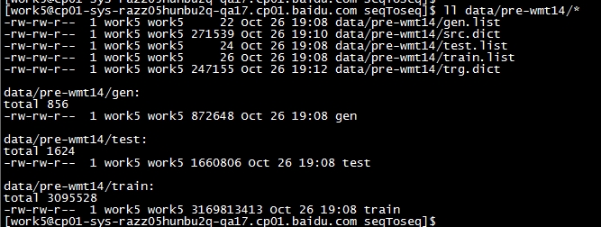

# **1. 【2015】Bidirectional LSTM-CRF Models for Sequence Tagging**

[论文地址](../assets/Bidirectional LSTM-CRF Models for Sequence Tagging.pdf)

# **2. 【2016】Conditional Random Fields as Recurrent Neural Networks**

[论文地址](../assets/Conditional Random Fields as Recurrent Neural Networks.pdf)

# **3. 在paddlepaddle上实现**

需要参考seq2seq的demo：[http://www.paddlepaddle.org/doc/demo/text_generation/text_generation.html](http://www.paddlepaddle.org/doc/demo/text_generation/text_generation.html)

先来了解一下seq2seq：
首先，拿到的数据是这样的（法语->英语,wmt14数据集）：


gen/test/train三个目录，每个下面有xx.src和xx.trg两个文件，一行是一句话，src和trg的相同行表示那句话对应的翻译是什么，所以，src和trg一样多行。

然后，需要进行预处理(-i INPUT: the path of input original dataset;-d DICTSIZE: the specified word count of dictionary, if not set, dictionary will contain all the words in input dataset;-m --mergeDict: merge source and target dictionary, thus, two dictionaries have the same context)

```shell
python preprocess.py -i data/wmt14 -d 30000
```

得到结果如下：



+ 其中，train/test/gen目录下是将原始数据的src和trg对应的行用\t连接起来生成的。
+ train/test/gen.list是上述三个目录对应文件的指针。
+ src/trg.dict是上述dict_size大小的字典，包括dict_size-3个高频词和3个特殊词：<s>（sequence的开头）<e>（sequence的结尾）<unk>（不在词典中的词）

接下来开始进行训练：

获取mpi job的status的脚本：get_mpi_job_status.py

```shell
## local
paddle train \
--config='translation/train.conf' \
--save_dir='translation/model' \
--use_gpu=false \
--num_passes=16 \
--show_parameter_stats_period=100 \
--trainer_count=4 \
--log_period=10 \
--dot_period=5 \
2>&1 | tee 'translation/train.log'

## cluster
dir="thirdparty"
cp ../dataprovider.py $dir/.
cp ../seqToseq_net.py $dir/.
cp ../data/pre-wmt14/src.dict $dir/.
cp ../data/pre-wmt14/trg.dict $dir/.

paddle cluster_train \
  --config=train.cluster.conf \
  --config_args=is_cluster=true \
  --use_gpu=cpu \
  --trainer_count=8 \
  --num_passes=16 \
  --log_period=10 \
  --thirdparty=./thirdparty \
  --num_nodes=2 \
  --job_priority=normal \
  --job_name=daiwenkai_paddle_platform_translation_demo \
  --time_limit=00:30:00 \
  --submitter=daiwenkai \
  --where=nmg01-hpc-off-dmop-cpu-10G_cluster

#fcr:--where=nmg01-hpc-off-dmop-cpu-10G_cluster
#fcr-slow:--where=nmg01-hpc-off-dmop-slow-cpu-10G_cluster
# http://wiki.baidu.com/pages/viewpage.action?pageId=204652252

jobid=`grep jobid train.log.$timestamp | awk -F'jobid=' '{print $2}' | awk -F'.' '{print $1}'`
echo $jobid
~/.jumbo/bin/python $workspace_path/get_mpi_job_status.py -j $jobid -s ecom_off
[[ $? -ne 0 ]] && echo "mpi job failed...$jobid" && exit 1
```

