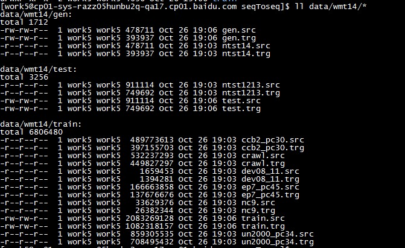
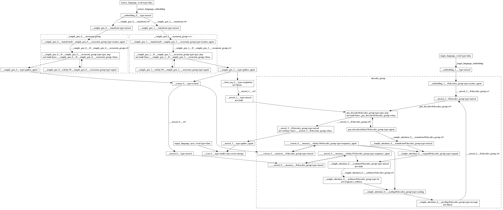
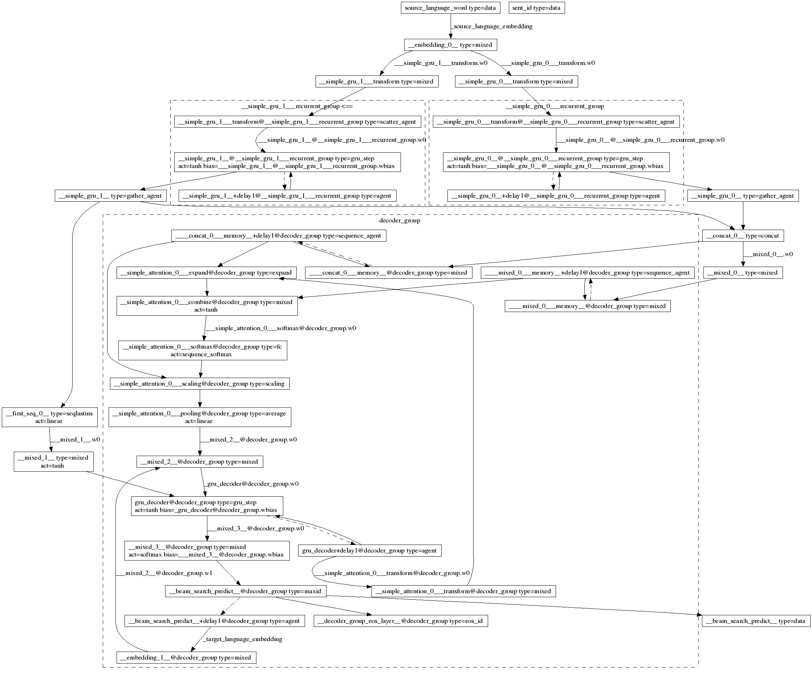

# **1. 【2015】Bidirectional LSTM-CRF Models for Sequence Tagging**

[论文地址](../assets/Bidirectional LSTM-CRF Models for Sequence Tagging.pdf)

# **2. 【2016】Conditional Random Fields as Recurrent Neural Networks**

[论文地址](../assets/Conditional Random Fields as Recurrent Neural Networks.pdf)

# **3. 在paddlepaddle上实现**

## 3.1 seq2seq的demo

需要参考seq2seq的demo：[http://www.paddlepaddle.org/doc/demo/text_generation/text_generation.html](http://www.paddlepaddle.org/doc/demo/text_generation/text_generation.html)

先来了解一下seq2seq：
首先，拿到的数据是这样的（法语->英语,wmt14数据集）：



gen/test/train三个目录，每个下面有xx.src和xx.trg两个文件，一行是一句话，src和trg的相同行表示那句话对应的翻译是什么，所以，src和trg一样多行。

然后，需要进行预处理(-i INPUT: the path of input original dataset;-d DICTSIZE: the specified word count of dictionary, if not set, dictionary will contain all the words in input dataset;-m --mergeDict: merge source and target dictionary, thus, two dictionaries have the same context)

```shell
python preprocess.py -i data/wmt14 -d 30000
```

得到结果如下：


+ 其中，train/test/gen目录下是将原始数据的src和trg对应的行用\t连接起来生成的。
+ train/test/gen.list是上述三个目录对应文件的指针。
+ src/trg.dict是上述dict_size大小的字典，包括dict_size-3个高频词和3个特殊词：<s\>（sequence的开头）<e\>（sequence的结尾）<unk\>（不在词典中的词）

接下来开始进行训练：

```python

#其实seq_to_seq_data里面，读trg.dict和src.dict的时候，使用了
#trg_dict = dict()
#for line_count, line in enumerate(open(trg_lang_dict, "r")):
#    trg_dict[line.strip()] = line_count
#对dict文件的每个单词，按照行号进行了编号！！

#train.conf
import sys
sys.path.append("..")

from seqToseq_net import *

# whether this config is used for generating
is_generating = False

### Data Definiation
data_dir  = "./data/pre-wmt14"
train_conf = seq_to_seq_data(data_dir = data_dir,
                             is_generating = is_generating)

### Algorithm Configuration
settings(
    learning_method = AdamOptimizer(),
    batch_size = 50,
    learning_rate = 5e-4)

### Network Architecture
gru_encoder_decoder(train_conf, is_generating)


#train.cluster.conf
#edit-mode: -*- python -*-
import sys
sys.path.append("..")

### for cluster training
cluster_config(
    fs_name = "hdfs://nmg01-mulan-hdfs.dmop.baidu.com:54310",
    fs_ugi = "paddle_demo,paddle_demo",
    work_dir ="/app/idl/idl-dl/paddle/demo/seqToseq/",
)

from seqToseq_net import *

# whether this config is used for generating
is_generating = False
# whether this config is used for cluster training
is_cluster = get_config_arg('is_cluster', bool, False)

### Data Definiation
data_dir  = "./data/pre-wmt14" if not is_cluster else "./"
train_conf = seq_to_seq_data(data_dir = data_dir,
                             is_generating = is_generating)

### Algorithm Configuration
settings(
    learning_method = AdamOptimizer(),
    batch_size = 50,
    learning_rate = 5e-4)

### Network Architecture
gru_encoder_decoder(train_conf, is_generating)
```

train.conf对应的网络结构图(慎入！。。)：



注：获取mpi job的status的脚本：[get_mpi_job_status.py](../source_codes/get_mpi_job_status.py)

```shell

#num_passes: set number of passes. One pass in paddle means training all samples in dataset one time
#show_parameter_stats_period: here show parameter statistic every 100 batches
#trainer_count: set number of CPU threads or GPU devices
#log_period: here print log every 10 batches
#dot_period: here print ‘.’ every 5 batches

## local
paddle train \
--config='translation/train.conf' \
--save_dir='translation/model' \
--use_gpu=false \
--num_passes=16 \
--show_parameter_stats_period=100 \
--trainer_count=4 \
--log_period=10 \
--dot_period=5 \
2>&1 | tee 'translation/train.log'

## cluster
dir="thirdparty"
cp ../dataprovider.py $dir/.
cp ../seqToseq_net.py $dir/.
cp ../data/pre-wmt14/src.dict $dir/.
cp ../data/pre-wmt14/trg.dict $dir/.

paddle cluster_train \
  --config=train.cluster.conf \
  --config_args=is_cluster=true \
  --use_gpu=cpu \
  --trainer_count=8 \
  --num_passes=16 \
  --log_period=10 \
  --thirdparty=./thirdparty \
  --num_nodes=2 \
  --job_priority=normal \
  --job_name=daiwenkai_paddle_platform_translation_demo \
  --time_limit=00:30:00 \
  --submitter=daiwenkai \
  --where=nmg01-hpc-off-dmop-cpu-10G_cluster

#fcr:--where=nmg01-hpc-off-dmop-cpu-10G_cluster
#fcr-slow:--where=nmg01-hpc-off-dmop-slow-cpu-10G_cluster
# http://wiki.baidu.com/pages/viewpage.action?pageId=204652252

jobid=`grep jobid train.log.$timestamp | awk -F'jobid=' '{print $2}' | awk -F'.' '{print $1}'`
echo $jobid
~/.jumbo/bin/python $workspace_path/get_mpi_job_status.py -j $jobid -s ecom_off
[[ $? -ne 0 ]] && echo "mpi job failed...$jobid" && exit 1
```

日志形如：

```shell
#I0719 19:16:45.952062 15563 TrainerInternal.cpp:160]  Batch=10 samples=500 AvgCost=198.475 CurrentCost=198.475 Eval: classification_error_evaluator=0.737155  CurrentEval: classification_error_evaluator=0.737155
#I0719 19:17:56.707319 15563 TrainerInternal.cpp:160]  Batch=20 samples=1000 AvgCost=157.479 CurrentCost=116.483 Eval: classification_error_evaluator=0.698392  CurrentEval: classification_error_evaluator=0.659065
#.....

#AvgCost: Average Cost from 0th batch to current batch
#CurrentCost: Cost in current batch
#classification_error_evaluator(Eval): False prediction rate for each word from 0th evaluation to current evaluation
#classification_error_evaluator(CurrentEval): False prediction rate for each word in current evaluation
```

最后，需要生成文本：

首先，把模型文件拷到data/wmt14_model目录下，然后gen.conf如下：

```python
import sys
sys.path.append("..")

from seqToseq_net import *

# whether this config is used for generating
is_generating = True

### Data Definiation
gen_conf = seq_to_seq_data(data_dir = "./data/pre-wmt14",
                           is_generating = is_generating,
                           gen_result = "./translation/gen_result")

### Algorithm Configuration
settings(
      learning_method = AdamOptimizer(),
      batch_size = 1,
      learning_rate = 0)

### Network Architecture
gru_encoder_decoder(gen_conf, is_generating)
```

gen.conf对应的网络结构图(慎入！。。)：



生成的命令如下

```shell
# local
paddle train \
    --job=test \
    --config='translation/gen.conf' \
    --save_dir='data/wmt14_model' \
    --use_gpu=false \
    --num_passes=13 \
    --test_pass=12 \
    --trainer_count=1 \
    2>&1 | tee 'translation/gen.log'

#job: set job mode to test
#save_dir: the path of saved models
#num_passes and test_pass: loading model parameters from test_pass to (num_passes - 1), here only loads data/wmt14_model/pass-00012

```

【然而。。用jumbo装的paddle有问题。。版本太老。。我们从源码再来装一个好了。。：

[http://deeplearning.baidu.com/doc_cn/build/internal/build_from_source_zh_cn.html#jumbo](http://deeplearning.baidu.com/doc_cn/build/internal/build_from_source_zh_cn.html#jumbo)

代码在这里[install_paddle_dwk.sh](../source_codes/install_paddle_dwk.sh)】

gen的结果是这个文件translation/gen_result，内容如下：

```shell
0
0       -11.1314         The <unk> <unk> about the width of the seats while large controls are at stake <e>
1       -11.1519         The <unk> <unk> on the width of the seats while large controls are at stake <e>
2       -11.5988         The <unk> <unk> about the width of the seats while large controls are at stake . <e>

1
0       -24.4149         The dispute is between the major aircraft manufacturers about the width of the tourist seats on the <unk> flights , paving the way for a <unk> confrontation during the month of the Dubai <unk> . <e>
1       -26.9524         The dispute is between the major aircraft manufacturers about the width of the tourist seats on the <unk> flights , paving the way for a <unk> confrontation during the month of Dubai &apos; s <unk> . <e>
2       -27.9574         The dispute is between the major aircraft manufacturers about the width of the tourist seats on the <unk> flights , paving the way for a <unk> confrontation during the month of Dubai &apos; s Dubai <unk> . <e>
...

```

解释：

```shell
#This is the beam search result, where beam size is 3
#‘0’ in 1st-line and ‘1’ in 6th-line mean the sequence-id in gen data
#Other six lines list the beam search results
#  The 2nd-column is the score of beam search (from large to small)
#  The 3rd-colunm is the generating English sequence
#There is 2 special tokens:
#  <e>: the end of a sequence
#  <unk>: a word not included in dictionary

```

## 3.2 bilstm+crf

