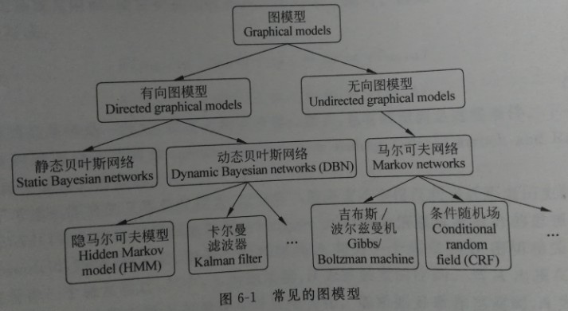
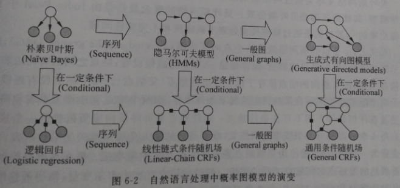
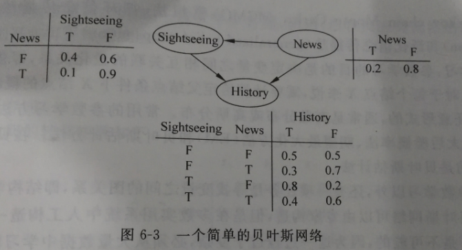

# **1. 概率图模型**

概率图模型(probalistic graphical models)在**概率模型**的基础上，使用了**基于图的方法**来表示概率分布（或者概率密度、密度函数），是一种通用化的不确定性知识表示和处理方法。概率图模型的表达中，**结点表示变量**，**结点之间的边表示相应变量之间的对应关系**。

例如，假设S为一个汉语句子，X是句子S切分出来的词序列，那么，分词的过程可以看作是推断使`\(P(X|S)\)`最大的词序列X的分布。而词性标注中，可以看作在给定序列X的情况下，寻找一组最可能的词性标签分布T，使得`\(P(T|X)\)`最大。

根据图模型的边是否有向，可以分为有向概率图模型和无向概率图模型：

 

而概率图模型在nlp中的演变过程如下所示：

# **2. 贝叶斯网络**

贝叶斯网络又称**信度网络或信念网络**（belief networks），基础理论是贝叶斯公式，目的是通过**概率推理** 处理**不确定性和不完整性问题**。

一个贝叶斯网络就是一个**有向无环图**（directed acyclic graph, DAG），**结点表示随机变量** （可观测量/隐含变量/未知参量或假设等），**有向边表示条件依存关系**（箭头指向的结点依存于发出箭头的结点【父节点】）。两个结点没有连线表示两个随机变量在某些特定情况下**条件独立**，如果有连线，则任何条件下都不可能条件独立。

每一个结点都和一个概率函数相关，概率函数的输入是该结点的父结点所表示的随机变量的一组特定值，输出为当前结点表示的随机变量的概率值。概率值的大小表示结点之间已存关系的强度。

对于一篇写了某个岛屿的文章而言，是否是一篇新闻记为事件N，是否记录了历史记为事件H，是否记录了旅游风光记为事件S。

**

则三个事件的联合概率函数为：
`\[
P(H,S,N)=P(H|S,N)P(S|N)P(N)
\]`

下面我们来算一个概率：一篇关于某岛屿的文章是记录了历史，那么，它是一篇新闻的概率有多大？

`\[
P(N=T|H=T)=\frac{P(H=T,N=T))}{P(H=T))}\\
=\frac {\sum _{S\in \{T,F\}}P(H=T,S,N=T)} {\sum _{N,S\in \{T,F\}}P(H=T,S,N)}\\
=\frac{(0.4\times 0.1\times 0.2=0.008)_{TTT}+(0.3\times 0.9\times 0.2=0.054)_{TFT}}{0.008_{TTT}+0.054_{TFT}+0.256_{TTF}+0.24_{TFF}}\\
=11.11%
\]`

# **3. 马尔可夫模型**

# **4. 隐马尔可夫模型**

# **5. 层次化的隐马尔可夫模型**

# **6. 层次化的隐马尔可夫模型**

# **7. 最大熵模型**

# **8. 最大熵隐马尔可夫模型**

# **9. CRF**

CRF(Conditional Random Field)条件随机场是用于标注和划分**序列结构数据**的**概率化**结构模型。

对于给定的输出标识序列Y和观测序列X，CRF通过定义**条件概率`\(P(Y|X)\)`**而非联合概率`\(P(X,Y)\)`来描述模型。也可以将CRF看作一个**无向图模型**或者，马尔可夫随机场（Markov Random Field）。

定义：设`\(G=(V,E)\)`为一个无向图，`\(V\)`为结点集合，`\(E\)`为无向边的集合。`\(Y=\{Y_v|v\in V\}\)`，即`\(V\)`中的 每一个结点对应于一个随机变量`\(Y_v\)`，其取值范围为可能的标记集合`\(\{y\}\)`。如果以观察序列`\(X\)`为条件，每一个随机变量`\(Y_v\)`都满足以下马尔可夫特性 \eqref{eq:9.1}：

`\[
p(Y_v|X,Y_w,w\neq v)=P(Y_v|X,Y_w,w\sim v)
\tag{Eq-9.1}
\label{eq:9.1}
\]`

其中`\(，w\sim v\)`表示两个结点在图`\(G\)`中是邻近结点。那么`\((X,Y)\)`为一个随机场。

理论上，只要在标记序列中描述了一定的条件独立性，`\(G\)`的图结构可以是任意的。对序列进行建模可以形成最简单、最普通的链式结构（chain-structured）图，结点对应标记序列`\(Y\)`中的元素：

显然，观察序列`\(X\)`的元素之间并不存在图结构，因为这里只是将观察序列`\(X\)`作为条件，并不对其做任何独立性假设。

在给定观察序列`\(X\)`时，某个特定标记序列`\(Y\)`的概率可以定义为 \eqref{eq:9.2}：
`\[
exp(\sum _j \lambda _jt_j(y_{i-1},y_i,X,i)+\sum _k \mu _ks_k(y_i,X,i))
\tag{Eq-9.2}
\label{eq:9.2}
\]`

其中，`\(t_j(y_{i-1},y_i,X,i)\)`是**转移函数**，表示对于观察序列`\(X\)`及其标注序列`\(i\)`及`\(i-1\)`位置上标记的转移概率。

`\(s_k(y_i,X,i)\)`是**状态函数**，表示对于观察序列`\(X\)`其`\(i\)`位置的标记概率。

`\(\lambda _j\)`和`\(\mu _k\)`分别是`\(t_j\)`和`\(s_k\)`的权重，需要从训练样本中预估出来（模型参数）。

参照最大熵模型的做法，在定义特征函数时可以定义一组关于观察序列的`\(\{0,1\}\)`二值特征`\(b(X,i)\)`来标识训练样本中某些分布特性，例如

`\[
b(X,i) = 
\begin{cases}
1, X的i位置为某个特定的词 \\
0, else \\
\end{cases}
\]`

转移函数可以定义为如下形式：

`\[
t_j(y_{i-1},y_i,X,i) = 
\begin{cases}
b(X,i), y_{i-1}和y_i满足某种搭配条件 \\
0, else \\
\end{cases}
\]`

为了便于描述，可以将状态函数写成如下形式：
`\[
s(y_i,X,i)=s(y_{i-1},y_i,X,i)
\]`

这样，特征函数可以统一表示为 \eqref{eq:9.3}：
`\[
F_j(Y,X)=\sum _{i=1}^{n}f_j(y_{i-1},y_i,X,i)
\tag{Eq-9.3}
\label{eq:9.3}
\]`

其中，每个局部特征函数`\(f_j(y_{i-1},y_i,X,i)\)`表示状态特征`\(s(y_{i-1},y_i,X,i)\)`或转移函数`\(t_j(y_{i-1},y_i,X,i)\)`。

由此，条件随机场定义的条件概率如下\eqref{eq:9.4}：
`\[
p(Y|X,\lambda )=\frac{1}{Z(X)}exp(\lambda _j\cdot F_j(Y,X))
\tag{Eq-9.4}
\label{eq:9.4}
\]`

其中，分母`\(Z(X)\)`为归一化因子\eqref{eq:9.5}：
`\[
Z(X)=\sum _Yexp(\lambda _j \cdot F_j(Y,X))
\tag{Eq-9.5}
\label{eq:9.5}
\]`

条件随机场模型也需要解决3个问题：**特征的选取、参数训练和解码**。训练过程可以在训练数据集上基于**对数似然函数的最大化**进行。

相对于HMM,CRF的主要优点在于他的**条件随机性**，只需要考虑当前已经出现的观测状态，**没有独立性的严格要求** ，对于整个序列内部的信息和外部观测信息均可有效利用，**避免了**MEMM（最大熵隐马尔可夫模型）和其他针对线性序列模型的条件马尔可夫模型会出现的**标识偏置问题**。(the transitions leaving a given
state compete only against each other, rather than against
all other transitions in the model.In the extreme
case, a state with a single outgoing transition effectively
ignores the observation. In those cases, unlike in HMMs,
Viterbi decoding cannot downgrade a branch based on observations
after the branch point, and models with statetransition
structures that have sparsely connected chains of
states are not properly handled.)

CRF具有MEMM的一切优点，亮着的关键区别在于，MEMM使用每一个状态的指数模型来计算给定前一个状态下当前状态的条件概率，而CRF用**单个指数模型来计算给定观察序列和整个标记序列的联合概率**。因此，不同状态的不同特征权重可以相互交换代替。(The critical difference between CRFs and
MEMMs is that a MEMM uses per-state exponential models
for the conditional probabilities of next states given the
current state, while a CRF has a single exponential model
for the joint probability of the entire sequence of labels
given the observation sequence.)

(We can also think of a CRF as a finite state model with unnormalized
transition probabilities. However, unlike some
other weighted finite-state approaches (LeCun et al., 1998),
CRFs assign a well-defined probability distribution over
possible labelings, trained by maximum likelihood or MAP
estimation. Furthermore, the loss function is convex,2 guaranteeing
convergence to the global optimum.)

<html>

<table border="2" cellspacing="0" cellpadding="6" rules="all" frame="border">

<thead>
<tr>
<th scope="col" class="left">算法</th>
<th scope="col" class="left">优缺点</th>
</tr>
</thead>

<tbody>
<tr>
<td class="left">隐马尔可夫模型(HMM)</td>
<td class="left">最大的缺点就是由于其输出独立性假设，导致其不能考虑上下文的特征，限制了特征的选择</td>
</tr>
<tr>
<td class="left">最大熵隐马尔可夫模型(MEMM)</td>
<td class="left">解决了隐马的问题，可以任意选择特征，但由于其在每一节点都要进行归一化，所以只能找到局部的最优值，同时也带来了标记偏见的问题，即凡是训练语料中未出现的情况全都忽略掉</td>
</tr>
<tr>
<td class="left">条件随机场（CRF）</td>
<td class="left">很好的解决了这一问题，他并不在每一个节点进行归一化，而是所有特征进行全局归一化，因此可以求得全局的最优值。</td>
</tr>
</tbody>
</table>

</html>

crf经典资料：

+ 开山之作：[Conditional random fields: Probabilistic models for segmenting and labeling sequence data(Lafferty,2001)](../assets/Conditional random fields Probabilistic models for segmenting and labeling sequence data.pdf)

工具：**CRF++(c++)/CRFSuite(c)/MALLET(java)/nltk(python)**
