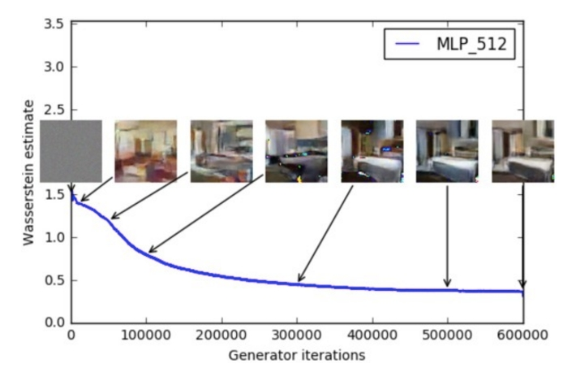

参考：[微信公众号"机器之心"文章](https://mp.weixin.qq.com/s?__biz=MzA3MzI4MjgzMw==&mid=2650722818&idx=3&sn=03cb67c8a8ee7f83a7448b518f4336ab&chksm=871b167cb06c9f6a018a99b79d8b2764b207be2b4d03f132151d99124edf2aff4c116a9dc98d&scene=0&pass_ticket=vjEpmxe2DG4P%2By4GjgdfVEMIt0g0SpbViafCaNrBt8viOsGkibUK9SIS47UfCM27#rd)

参考：[知乎专栏:令人拍案叫绝的Wasserstein GAN](https://zhuanlan.zhihu.com/p/25071913)

主要效果如下：

+　彻底解决GAN**训练不稳定**的问题，不再需要小心平衡生成器和判别器的训练程度
+　基本解决了**collapse mode**的问题，确保了生成样本的多样性 
+　训练过程中终于有一个像交叉熵、准确率这样的**数值来指示训练的进程**，这个**数值越小代表GAN训练得越好**，代表生成器产生的图像质量越高(如下图所示)

+　以上一切好处不需要精心设计的网络架构，**最简单的多层全连接网络就可以做到**

主要改进有以下四点：

+ **判别器最后一层去掉sigmoid**(原始GAN的判别器做的是true/false二分类任务，所以最后一层是sigmoid，但是现在WGAN中的判别器做的是近似拟合**Wasserstein距离，属于回归任务**，所以要把最后一层的sigmoid拿掉。)
+ **生成器和判别器的loss不取log**
+ **每次更新判别器的参数之后把它们的绝对值截断到不超过一个固定常数c**
+ **不要用基于动量的优化算法**（包括momentum和Adam），**推荐RMSProp**，SGD也行

