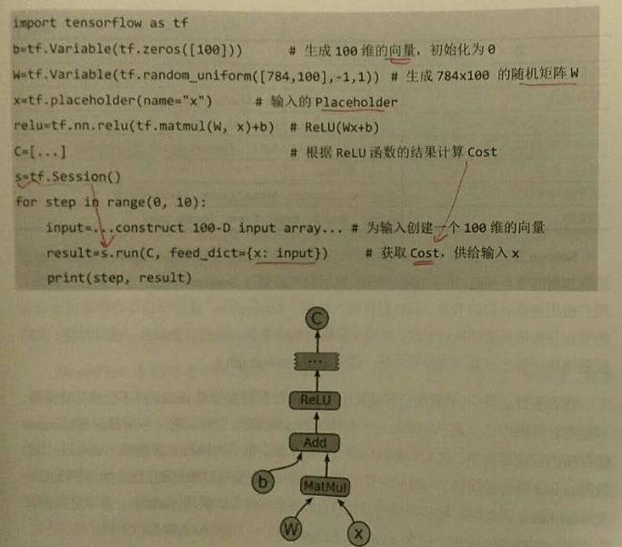
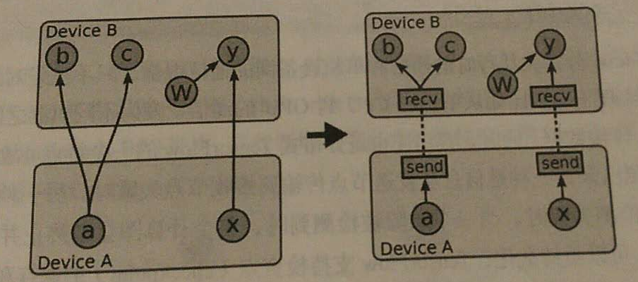
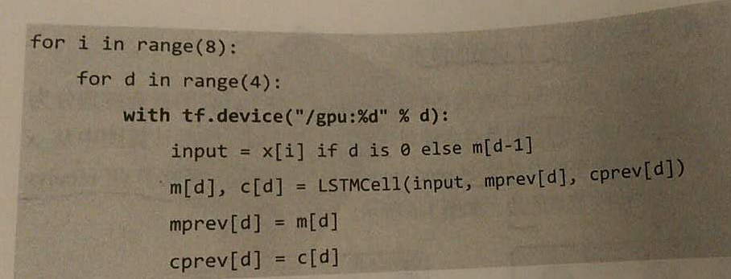
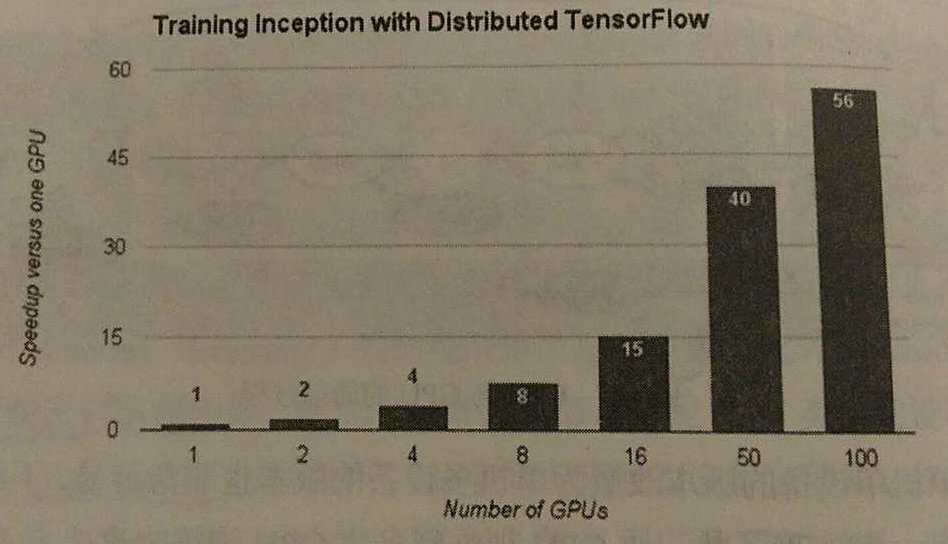
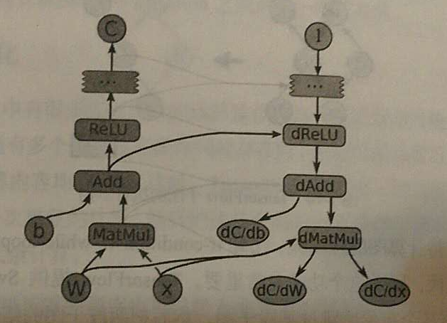
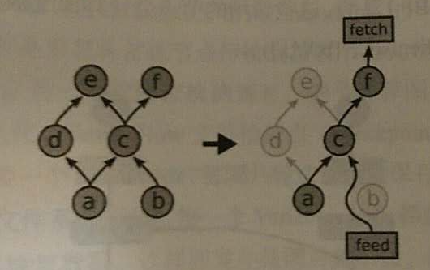

**目录**

  * [1. 概要](#1-概要)
  * [2. 编程模型简介](#2-编程模型简介)
     * [2.1 核心概念](#21-核心概念)
     * [2.2 实现原理](#22-实现原理)
        * [2.2.1 节点分配策略](#221-节点分配策略)
        * [2.2.2 通信机制](#222-通信机制)
        * [2.2.3 分布式通讯机制](#223-分布式通讯机制)
     * [2.3 拓展功能](#23-拓展功能)
        * [2.3.1 自动求导](#231-自动求导)
        * [2.3.2 单独执行子图](#232-单独执行子图)
        * [2.3.3 计算图的控制流](#233-计算图的控制流)
        * [2.3.4 自定义数据输入方式](#234-自定义数据输入方式)
        * [2.3.5 队列](#235-队列)
        * [2.3.6 容器](#236-容器)
     * [2.4 性能优化](#24-性能优化)
        * [2.4.1 数据并行](#241-数据并行)
        * [2.4.2 模型并行](#242-模型并行)
        * [2.4.1 流水线并行](#241-流水线并行)

-- 整理自《tensorflow实战》 chap 1

## 1. 概要
+ 2015年11月，tensorflow在github上开源。
+ 2016年4月，发布了分布式版本。
+ 2017年1月，发布1.0版本的预览。

注：而google还开源了android、Chromium、Go、Javascript V8、protobuf、Bazel(编译工具)、Tesseract(OCR工具)……

2011年，Google启动了Google Brain，同时搞了第一代分布式机器学习框架DistBelief，约50个项目在用。之后搞了tensorlfow，将Inception Net从DistBelief迁移到tf后，有6倍的训练速度提升。截至2016年，Google内近2k个项目用了tf。

tf的一些特点：
+ 使用tf，不需要给大规模的模型训练和小规模的应用分别开发部署不同的系统，**避免了同时维护两套程序的成本。**
+ tf的计算可以表示为**有状态的数据流式图**，对于大规模的神经网络训练，可以简单地实现并行计算，同时使用**不同的硬件资源**进行训练，**同步或异步**地更新**全局共享**的模型**参数和状态**。
+ **串行改并行**的改造成本非常低。
+ 前端支持py、cxx、go、java等语言，后端使用cxx、cuda。
+ 除了ml/dl，tf抽象的数据流式图也可以应用在**通用数值计算和符号计算**上（如分形图计算或者偏微分方程数值求解）

## 2. 编程模型简介

### 2.1 核心概念

tf中的计算可以表示为有向图（directed graph）或计算图（computation graph）。

每个运算操作是一个节点，节点间的连接是边。

**每个节点可以有任意多的输入和输出**，节点可以算作运算操作的实例化（instance）。在边中流动的数据称为张量（tensor）。**tensor的数据类型，可以一开始定义好，也可以通过计算图的结构推断得到。**

**没有数据流动**的特殊的边：依赖控制（control dependencies），作用是起始节点执行完再执行目标节点，例如控制内存使用的最高峰值。

示例：

运算核（kernel）是一个运算操作中某个具体硬件（cpu/gpu...）中的实现。tf中，可以通过**注册机制**，加入新的运算或运算核。tf的内建运算操作如下：

+ 标量运算：Add/Sub/Mul/Div/Exp/Log/Greater/Less/Equal
+ 向量运算：Concat/Slice/Split/Constant/Rank/Shape/Shuffle
+ 矩阵运算：MatMul/MatrixInverse/MatrixDeterminant
+ 带状态的运算：Variable/Assign/AssignAdd
+ 神经网络组件：SoftMax/Sigmoid/ReLU/Convolution2D/MaxPooling
+ 存储、恢复：Save/Restore
+ 队列及同步运算：Enqueue/Dequeue/MutexAcquire/MutexRelease
+ 控制流：Merge/Switch/Enter/Leave/NextIteration

session是用户使用tf时的交互式接口，可以通过Session的**extend方法添加新的节点和边**，然后run。

大多数运算中，计算图会被反复执行多次，数据（即tensor）并不会被持续保留。**但Variable是特殊的运算操作，可以将一些需要保留的tensor存储在内存或显存中，同时可以被更新，如模型参数。**Assign/AssignAdd/AssignMul都是Variable的特殊操作。

### 2.2 实现原理

client通过session的接口和master以及多个worker相连。而每个worker可以和多个硬件设备相连。master可以指导所有worker按流程执行计算图。

+ 单机：client、master、worker在同一台机器的同一个进程中
+ 分布式：client、master、worker在不同机器的不同进程中，由集群调度系统统一管理各任务。

**一个worker可以管理多个设备**，**每个设备**的name包含**硬件类别、编号、任务号**（单机没有）：

+ 单机：/job:localhost/device:cpu:0
+ 分布式：/job:worker/task:17/device:gpu:3

tf为cpu和gpu提供了管理设备的对象接口，每一个对象负责**分配、释放设备的内存**，以及**执行节点的运算核。**每个设备有单独的allocator负责存储各种数据类型的tensor，同时tensor的引用次数也会被记录，**引用次数为0时，内存会被释放。**

如果只有一个设备，计算图会按照依赖关系被顺序执行。当一个节点所有上游依赖都被执行完时（依赖数位0），这个节点就会被加入ready queue以等待执行。同时，下游所有节点的依赖数减1（标准的计算拓扑序的方式）。而对于多设备，有以下2个难点：

+ 问题1：每一个节点该让**什么硬件设备**执行
+ 问题2：如何管理节点间的**数据通信**

#### 2.2.1 节点分配策略

针对问题1，tf有一个为节点分配设备的策略。

首先需要计算一个**代价模型，估算每个节点的输入、输出tensor的大小，以及所需计算时间。**此代价模型一部分由人工经验指定的启发式规则得到，另一部分由对一小部分数据进行实际运算测量得到。

接下来，分配策略会模拟执行整个计算图，从起点开始，按拓扑序执行。在模拟执行某节点时，会将能执行此节点的所有设备都测试一遍，考虑代价模型对这个节点的计算时间的估算，加上数据传输到这个节点的通信时间，最后选择综合时间最短的设备作为执行设备（贪婪策略，不能保证全局最优）。

考虑的因素除了时间之外，还有内存的最高使用峰值。也允许用户对节点分配设置限制条件，例如，“只给此节点分配gpu设备”，“只给此节点分配/job:worker/task:17上的设备”，“此节点分配的设备必须和variable3一致”。tf会先计算每个节点可用的设备，然后用**[并查集（union-find）](http://blog.csdn.net/dm_vincent/article/details/7655764)**找到必须使用同一设备的节点。

#### 2.2.2 通信机制

针对问题2， 就是所谓的通信机制了。

当节点分配设备的方案确定了，整个计算图就会被划分为多个子图，使用同一设备并相邻的节点会被划分到同一子图。然后图中的边，会被替换成一个发送节点（send node）和一个接收节点（receive node），以及一条从发送节点到接收节点的边。两个子图间可能有多个接收节点，如果这些接收节点接收的是同一个tensor，那么所有这些接收节点会被合成同一个节点。

这样的通讯机制可以转化为发送节点和接收节点的实现问题，用户无须设计节点间的通信流程，可以用同一套代码自动扩展到不同硬件环境并处理复杂的通信流程。下图就是cpu和gpu间的通讯。

代码层面，从单机单设备到单机多设备的修改，只要一行，就可以实现单gpu到多gpu的修改。

#### 2.2.3 分布式通讯机制

+ 发送节点和接收节点与单机的实现不同：变为不同机器间使用TCP或RDMA（Remote Direct Memory Access,不需要cpu的参与直接把数据复制到远程机器的内存指定地址的操作。）。

+ 容错方面，故障会在两种情况下被检测，一种是信息从发送节点传输到接收节点失败时；另一种是周期性的worker心跳检测失败时。

+ 故障恢复：当故障被检测到时，整个计算图会被终止并重启。Variable node可以被持久化，tf支持检查点（checkpoint）的保存和恢复，每个Variable node都会链接到一个Save node，每隔几轮迭代就会保存一次数据到持久化的存储系统（例如分布式文件系统）。同样地，每个Variable node都会链接一个Restore node，每次重启时，都会被调用并恢复数据。所以，发生故障并重启后，模型参数将得到保留，训练可以从上一个checkpoint恢复而不需要从头开始。

另，GPU集群和单GPU的加速比变化如图。少于16卡时，基本没性能损耗。50卡时，加速比40。100卡时，加速比达到56。

### 2.3 拓展功能

#### 2.3.1 自动求导

+ 优势：

计算cost function的梯度是最基本需求，所以tf原生地支持**自动求导**。例如，tensor `\(C\)`在计算图中有一组依赖的tensor`\({X_k}\)`，那么，tf中可以自动求出`\(dC/dX_k\)`。此过程是通过在计算图中拓展节点的方式实现的，不过求梯度的节点对用户透明。

如图所示，计算tensor `\(C\)`关于tensor `\(I\)`的梯度时，会从`\(C\)`回溯到`\(I\)`，对回溯路径上的每个节点添加一个对应的求解梯度的节点，并依据链式法则计算总的梯度（BP）。这些新增的节点会计算梯度函数（gradient function），例如，`\([db,dW,dx]=tf.gradients(C, [b, W, x])\)`。

+ 问题：

自动求导带来的问题：tf对计算的优化（例如为节点分配设备的策略）会变得很麻烦，尤其是内存使用问题。正向执行计算图时，因为执行顺序是确定的，所以使用经验规则是较容易取得好效果的，tensor在产生后很快会被后续节点使用，不会持续占用内存。但反向传播时，往往要用到计算图开头的tensor,这些tensor可能会占用大量GPU显存，因此限制了模型的规模。

#### 2.3.2 单独执行子图

用户可以选择计算图的任意子图，沿某些边输入数据，从另一些边获取结果。tf用**节点名+port**的形式指定数据，例如，a:0表示a节点的第一个输出。用户**可以**选择一组输入数据的映射，如name:port->tensor；用户**必须**指定一组输出数据，例如name[:port]。整个计算图会依据输入输出自动调整，输入节点会连接一个feed node，输出节点会连接一个fetch node，然后tf会依据输出数据自动推导哪些节点需要被执行。

#### 2.3.3 计算图的控制流

因为ml需要反复迭代，所以if-condition/while-loop之类控制流是很重要的。

+ Switch和Merge的operator：根据某个布尔值跳过某段子图，然后把某段子图的结果合并，实现if-else。

+ Enter、Leave和NextIteration：实现循环和迭代。

+ Loop中的每一次循环会有唯一的tag，其执行结果会输出成frame，可以方便地查询结果日志。

+ 控制流支持分布式。循环内的节点会被划分到不同的小的子图上，每个子图会连接控制节点，实现自己的循环，同时将循环终止等信号发送给其他子图。

+ 控制流支持对计算图中隐含的梯度计算节点的支持

+ 使用高级语言（如python）的if-else, while, for时，会被自动编译成operator。

#### 2.3.4 自定义数据输入方式

数据输入可以通过feed node, 也有特殊的input node，可以让用户直接输入文件系统的路径。

若从feed node输入数据，则数据必须从client读取，通过网络传到分布式系统的其他节点，有较大网络开销。直接用文件路径，可以让worker节点读取本地文件，提高效率。

#### 2.3.5 队列

队列可以让计算图的**不同节点异步地执行**。使用队列的目的：

+ 当一个batch的数据运算时，提前从磁盘读取下一个batch的数据，减少磁盘I/O阻塞时间。

+ 另外，还可以异步地计算许多梯度，再组合成一个更复杂的梯度。

除了传统的FIFO（先进先出）队列，tf还实现了洗牌队列(shuffling queue)，满足ml算法对随机性的要求，对于损失函数优化和模型收敛有帮助。

#### 2.3.6 容器

容器（container）是一种特殊的管理**长期变量**的机制。例如，Variable对象就存储在容器中。

+ **每个进程会有一个默认的容器一直存在，直到进程结束。**

+ **使用容器可以允许不同计算图的不同Session间共享一些状态值。**

### 2.4 性能优化

+ 避免冗余计算：tf中有许多高度抽象的运算操作，可能是由**多层**的复杂计算组合而成的。当有多个高阶运算操作同时存在时，它们的前几层可能是完全一致的重复计算（输入&运算完全一样），tf会自动识别这些重复计算，同时**改写计算图**，只执行一次重复计算。

+ 巧妙安排运算顺序：可以极大改善数据传输和内存占用问题。例如，适当调整顺序以错开某些数据同时存在于内存的时间，对显存较小的GPU尤其重要。tf也会精细地安排接收节点的执行时间，若节点过早地接收数据，数据会堆积在设备内存中，因此，tf有策略**让接收节点刚好需要数据来计算时才开始接收数据。**

三种不同的加速神经网络训练的并行计算模式：

#### 2.4.1 数据并行

#### 2.4.2 模型并行

#### 2.4.3 流水线并行

