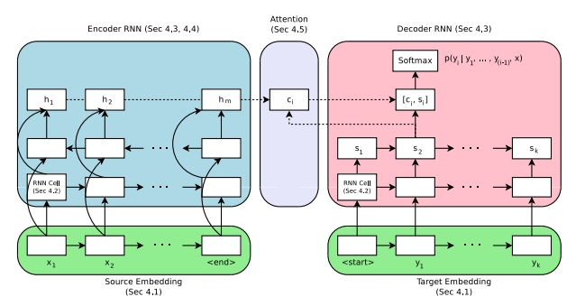

使用tf，但独立于tensorflow/models之外的一个seq2seq的框架：

主页：[https://google.github.io/seq2seq/](https://google.github.io/seq2seq/)

## 1. 简介

对应的论文：
[Massive Exploration of Neural Machine Translation Architectures](https://arxiv.org/pdf/1703.03906.pdf)

整体架构图：



## 2. 安装

首先安装python-tk（python的gui）

```
apt-get install python-tk
```

然后设置matplotlib的[backend](http://matplotlib.org/faq/usage_faq.html#what-is-a-backend)

```
echo "backend : Agg" >> $HOME/.config/matplotlib/matplotlibrc
```

然后安装seq2seq

```
cd seq2seq
pip install -e .
```

测试一下

```
python -m unittest seq2seq.test.pipeline_test
```

## 3. 基本概念


## 4. 示例：nmt

经典：
+ [Neural Machine Translation by Jointly Learning to Align and Translate](https://arxiv.org/abs/1409.0473)
+ [Neural Machine Translation and Sequence-to-sequence Models: A Tutorial (Neubig et al.)](https://arxiv.org/pdf/1703.01619.pdf)
+ [Tensorflow Sequence-To-Sequence Tutorial](https://www.tensorflow.org/tutorials/seq2seq)

### 4.1 数据格式

正常的分词是空格切分或者常用的分词工具（如Moses的[tokenizer.perl](https://github.com/moses-smt/mosesdecoder/blob/master/scripts/tokenizer/tokenizer.perl)、框架有[spacy](https://spacy.io/docs/usage/processing-text)/[nltk](http://www.nltk.org/api/nltk.tokenize.html)/[stanford的分词](https://nlp.stanford.edu/software/tokenizer.shtml)）。

但用于nmt时存在如下问题：
+ nmt输出的是在词上的概率分布，所以如果可能的词很多，那么会非常慢。如果vocabulary中有拼错的词和派生词，那vocabulary就可能趋向无穷大……而我们实际上可能会**人工限制vocabulary size在10,000-100,000的范围内。**
+ loved和loving来自同一词根，但却被当成完全不同的两个词来看待。

对于这种**open vocabulary**的问题一，一种解决方法就是从给定的文本中学习**subword units**。例如，loved可以被分成lov和ed，loving可以被分成lov和ing。这样，一方面可以产生新的词（unknown words），另一方面，可以缩减vocabulary size。本示例用到的就是**[Byte Pair Encoding (BPE)](https://arxiv.org/pdf/1508.07909.pdf)**

用法：

```
# Clone from Github
git clone https://github.com/rsennrich/subword-nmt
cd subword-nmt

# Learn a vocabulary using 10,000 merge operations
./learn_bpe.py -s 10000 < train.tok > codes.bpe

# Apply the vocabulary to the training file
./apply_bpe.py -c codes.bpe < train.tok > train.tok.bpe
```

结果如下，会用对不常见的词（如例子中的Nikitin）使用```@@```进行切分。

```
Madam President , I should like to draw your attention to a case in which this Parliament has consistently shown an interest. It is the case of Alexander Ni@@ ki@@ tin .
```

### 4.2 数据下载

使用预处理过的English-German WMT'16 Translation Task的数据集进行训练。 参考wmt16_en_de.sh，需要自定义```OUTPUT_DIR```变量。这个脚本下载数据、使用Moses Tokenizer进行分词、清理了training data、学习了约32,000的vocabulary大小的subword units.也可以直接去google drive下载预处理过的[WMT'16 EN-DE Data (502MB)](https://drive.google.com/open?id=0B_bZck-ksdkpM25jRUN2X2UxMm8)。

格式如下：

<html>
<center>
<table border="2" cellspacing="0" cellpadding="6" rules="all" frame="border">

<thead>
<tr>
<th scope="col" class="left">文件名</th>
<th scope="col" class="left">描述</th>

</tr>
</thead>

<tbody>
<tr>
<td class="left">train.tok.clean.bpe.32000.en</td>
<td class="left">The English training data, one sentence per line, processed using BPE.</td>
</tr>
<tr>
<td class="left">train.tok.clean.bpe.32000.de</td>
<td class="left">The German training data, one sentence per line, processed using BPE.</td>
</tr>
<tr>
<td class="left">vocab.bpe.32000</td>
<td class="left">The full vocabulary used in the training data, one token per line.</td>
</tr>
<tr>
<td class="left">newstestXXXX.*</td>
<td class="left">Development and test data sets, in the same format as the training data. We provide both pre-processed and original data files used for evaluation. </td>
</tr>

</tbody>
</table></center>
</html>	

### 4.3 小数据集：generate toy data

### 4.4 定义模型

### 4.5 训练

### 4.6 预测

### 4.7 使用beamsearch进行decode

### 4.8 基于checkpoint进行评估

### 4.9 计算BLEU